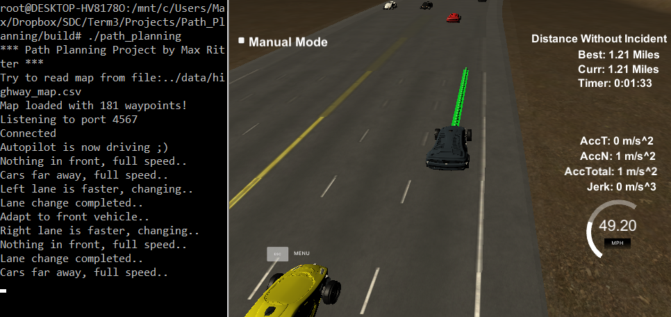
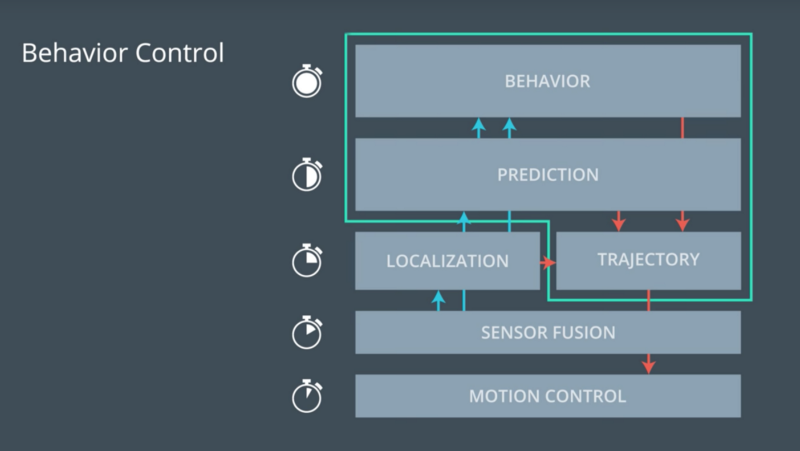
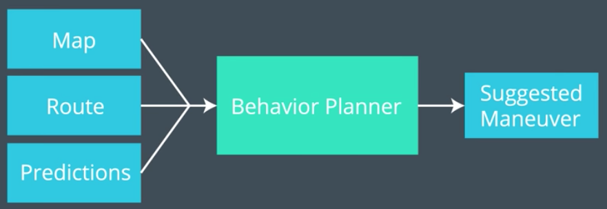
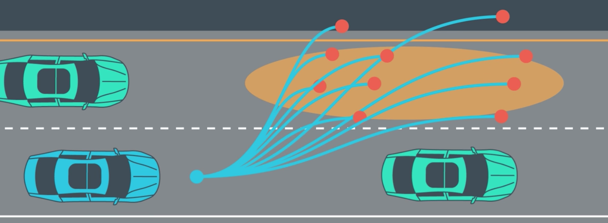

**Path Planning** 

The project's goal is to drive safely in a highway environment with three lanes and many other cars around. The car should be able to drive a complete round of almost 7km on the highway, change lanes, and adapt to the other cars speed if necessary. The speed limit is 50 MPH, which is around 80 km/h (very slow for me as a german highway driver!), and the car should try to adapt to it whenever possible. This project uses version 1.2 of the Udacity Simulator from [here](https://github.com/udacity/self-driving-car-sim/releases/tag/T3_v1.2).

**[Link to Youtube Video](https://youtu.be/Ijsn3nvHHug)**

Path planning is a process of finding a safe, comfortable and efficient path from start to goal, given a map, a start and goal position as well as one or several cost functions. The path planning algorithm consists of behavior, prediction and trajectory generation. It receives information from localization and sensor fusion, and passes the points to drive to motion control. The behavior module takes the longest time to calculate, and therefore is executed the least frequently. For the highway driving environment, an extensive behavior prediction of the other cars was not required, but could be mandatory in an urban territory for example.

The path planning module receives the following information:
1. 181 waypoints from the map as our reference path, each waypoint consists of x, y, s, dx and dy 2. Localization of the own car from the simulator, consisting of x, y, s, d, yaw and speed 3. Sensor fusion information about the other cars from the simulator, those include car ID, x, y, vx, vy, s and d 4. Previous path x and y coordinates from the simulator. It uses this information to generate a path made up of x and y points, that the car will visit sequentially every 0.02s. 

The behavior planning algorithm is called, whenever there is no activate lane change. It first assigns all vehicles around the car from sensor fusion to one of the three lanes and also calculates their velocity and displacement from our car. Afterwards, the lanes are sorted based on distance to the next car. Each lane is given an individual score, dpending on the results from the cost functions / metrics. Those take into account the distance to ahead cars with weight 3 and maximum distance of 100, the velocity difference to ahead cars with weight 2 and maximum velocity of 50 MPH, as well as the cost it takes to change a lane, with weight 1 and 0.5 cost per lane change.

After the lanes are ranked, it will be checked if there is a better lane to drive. If so, the next check is if it's feasible to do the lane change. If the car is faster than 40 MPH, a direct lane change over two lanes would cause too much jerk, so its not possible. Apart from that, we look for cars in front and behind for the indermediate and destination lane. Concerning the cars behind, a lane change is feasible if we are faster and have a distance of at least 15. If we are slower, a bigger distance of 30 is required. For the cars ahead, the same distance metrics are defined, but the comparison of the speed is the other way round. Every time all those conditions are fullfilled, we give the lane a positive vote. If one lane receives 20 votes, a lane change is started.

The speed of our car has to be adapted to the maximum limit of 50 MPH and the other cars in front of us. If there is no car on our current lane or the distance is greater than 40, we can give full speed and reach 80 km/h. In case there is a car in front with distance less than 40 but bigger than 15, we try to adapt our speed to this car. If the car brakes stronger, we need to slow down faster, but still keep in mind not to violate the total acceleration / jerk. An emergency brake will be issued, if the distance is below 5. That can happen sometimes, if another car changes to our lane suddenly, and there is no time to react any more.

In the last part of path planning, a trajectory is generated, based on the information from behavior planning. For this, I depend on the c++ cubic spline library from [here](https://github.com/ttk592/spline). It really helps to create smooth trajectories, without worrying about all the math behind. John Chen ([Github](https://github.com/diyjac/SDC-T3-P1 "Github")) inspired me to convert all coordinates to the locar car's coordinate system, in order to make things easier. Here the previous path points from the simulator are used, as all used up points are already removed.

First, we want to create an ideal path for the car to follow, by creating a spline with the nearest waypoints in our car reference frame. A second spline is formed from the previous path points, and both are merged to our lane tracking spline. This smooth trajectory gives us the ideal path from start to finish. Now we need to ensure, that we can follow the ideal trajectory without violating jerk and / or speed constraints. To do so, we need to create another spline, but this time for the velocity. This spline can be used to calculate the right x coordinates for our lane tracking spline, which are then feed back to the lane spline to calculate the y coordinates. At the end, all points are converted to global world points and passed to the simulator for driving.
 
The project was a very tricky one, I think it is the most complex project of the whole SDC program so far. But it was a lot of fun to try everything out with the nice 3D simulator, and have a simple, but fully functional highway autopilot at the end. I added a time delay of 100ms to compensate for the car to leave the left and right lane sometimes. My solution is inspired by other brilliant SDC students like [Mithi Sevilla](https://github.com/mithi/highway-path-planning), [John Chen](https://github.com/diyjac/SDC-T3-P1), [Mohan Karthik](https://github.com/mohankarthik/sdcnd/tree/master/projects/term3/P1-PathPlanning) and [Friedrich Schweizer](https://github.com/ByteShaker/CarND-Path-Planning-Project).

